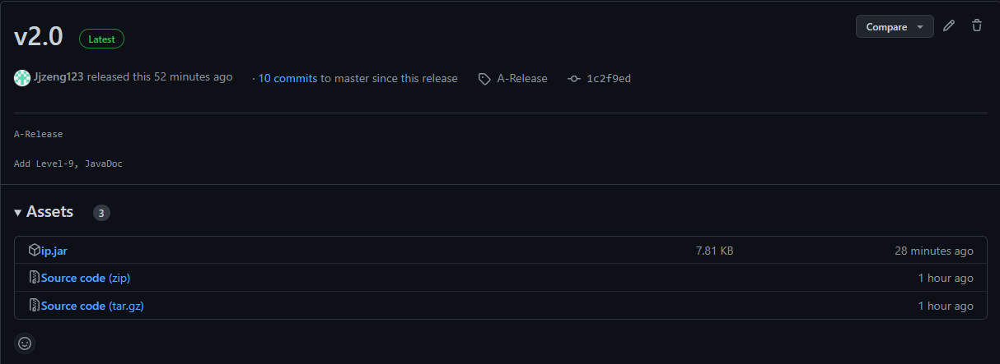
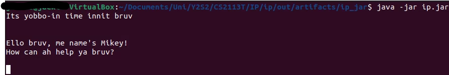
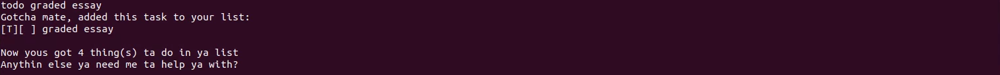
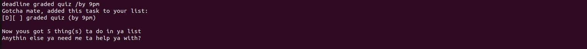
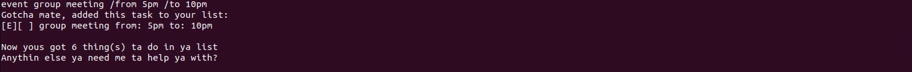
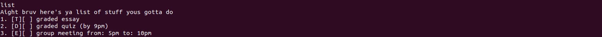
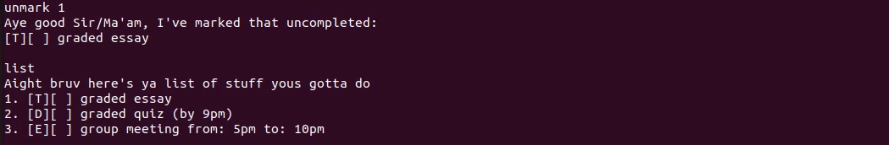
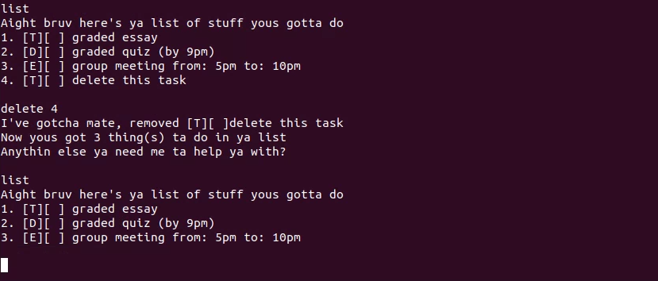
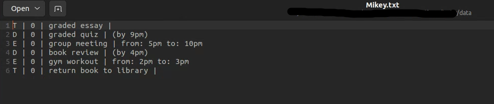

# User Guide
Hey there! Thanks for making Mikey your friend! He's here to help you with anything you may need, and this guide will help you get to know dear Mikey better! Let's jump right in!

# Table of Contents
1. [Getting Started](#getting-started)
2. [Features](#features)
   1. [Tasks](#tasks)
      1. [Todo](#todo)
      2. [Deadline](#deadline)
      3. [Event](#event)
   2. [List](#list)
   3. [Marking Tasks](#marking-tasks)
      1. [Mark](#mark)
      2. [Unmark](#unmark)
   4. [Delete](#delete)
   5. [Find](#find)
   6. [Saving](#saving)
3. [Command list](#command-list)
4. [Conclusion](#conclusion)
  
## Getting Started
1. Java 11 is required for Mikey to function properly, please make sure your device has Java 11 installed. If not, you may download it [here](https://www.oracle.com/sg/java/technologies/downloads/#java11)

2. Once you have ascertained that your device has Java 11 installed, you may download the .jar file [here](https://github.com/Jjzeng123/ip/releases/tag/A-Release). Place the file in a folder.

Click on ip.jar to automatically download the file.

3. Open the command terminal and navigate to the folder where you downloaded ip.jar using the `cd <file path>` commands as necessary.
4. Ensure that the terminal is in the correct folder.
5. Use the command `java -jar ip.jar` to launch Mikey.

6. When you are finished with Mikey's assistance, use the `bye` command to terminate the application. This will ensure that your data is saved properly for future access.

## Features 
The below sections will briefly explore some of Mikey's features. Mikey features three types of tasks: To do, Deadline, and Event. The following sections will explore each type of task as well as other features.

### Tasks
Mikey contains 3 different types of tasks for your convenience. The following sections will go into closer detail on how to use these tasks.

#### Todo
The Todo task takes a single parameter and creates a "to do" task that will be added to the list.
Use the command `todo <task>` to complete this action. For example, `todo graded essay`.

#### Deadline
The Deadline task requires both a task description and a date/time by which it is due.
Use the command `deadline <task> /by <date/time>` to complete this action. For example, `deadline graded quiz /by 9pm`.
The `/by` portion of the command is required for Mikey to distinguish between the two portions of the command. 

#### Event
The Event task requires a task description, a start date/time and an end date/time. 
Use the command `event <task> /from <start date/time> /to <end date/time>` to complete this action. For example, `event group meeting /from 5pm /to 10pm`.
The `/from` and `/to` portions of the command are required for Mikey to distinguish between the two portions of the command.

### List
The List command will display all your current tasks. Simply use the `list` command. This command ignores any other parameters that are erroneously entered after the `list` command.

### Marking Tasks
Mikey is able to help you mark tasks as complete or incomplete. New tasks are by default always added as incomplete. Incorrect use of this command will give an error message.

#### Mark tasks
Upon completing a task, you may use the command `mark <task index>` to mark it as complete. For example, `mark 1`.

#### Unmark tasks
If you wish to unmark a task, you may use the command `unmark <task index>` to mark it as incomplete. For example, `unmark 1`.

### Delete
Mikey unfortunately is unable to edit tasks. Should you make a mistake, you may want to delete a task. You may use the command `delete <task index>` to complete this action. For example, `delete 1`. 

### Find
If you wish to search the list of tasks by keyword, you may use the command `find <keyword>` to complete this action. For example, `find book`.

### Saving files
When Mikey is first launched, Mikey will create a text file in the current working directory, which should be the same directory as the location of the `.jar` file that you downloaded. 

Upon receiving the command `bye`, Mikey will save the information in a text file (Mikey.txt). The file will display the contents on individual lines, in the order of Task type, completion status, description and time information (if any). An example is shown below:

### Command List
The table below will contain the list of commands available to you, as well as example commands for your reference.

| Feature | Command | Examples |
| ------- | ------- | -------- |
| New To Do task | `todo <task>` | `todo graded quiz` |
| New Deadline task | `deadline <task> /by <date/time>` | `deadline essay submission /by Sunday 9pm` |
| New Event task | `event <task> /from <start date/time> /to <end date/time>` | `event group meeting /from 5pm /to 10pm` |
| List all tasks | `list` | `list` |
| Mark tasks completed | `mark <task index>` | `mark 3` |
| Unmark tasks | `unmark <task index>` | `unmark 2` |
| Delete tasks | `delete <task index>` | `delete 1` |
| Find by keyword | `find <keyword>` | `find book` |

## Conclusion
Thank you for using Mikey, I hope you have as much fun working with him as I did working on him! If you have any further queries or features you would like to suggest, please feel free to reach out to me at [my email](jackie.zeng@u.nus.edu)!
